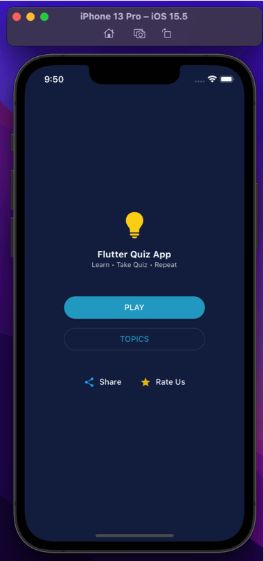
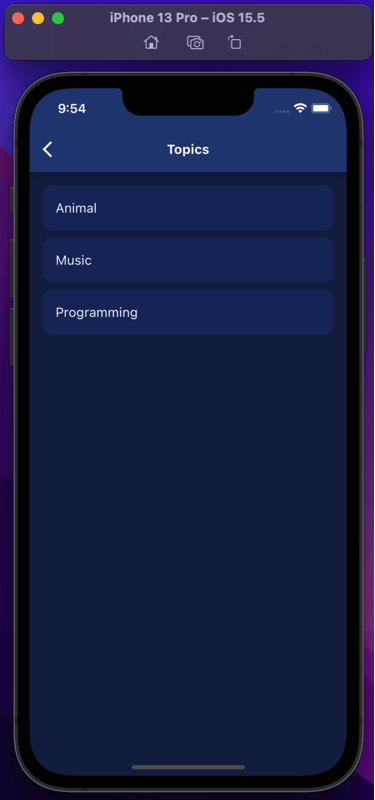
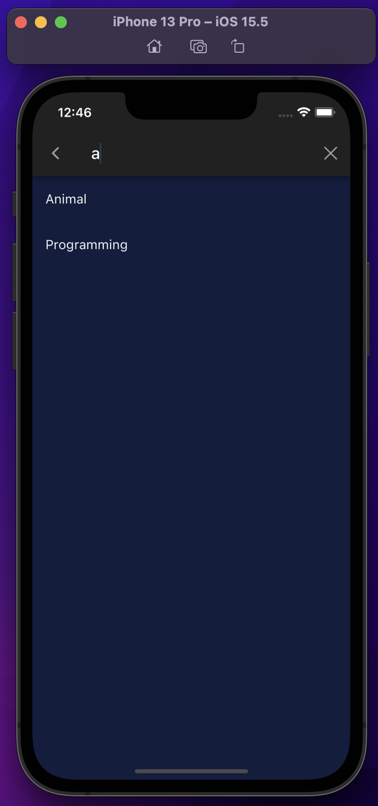
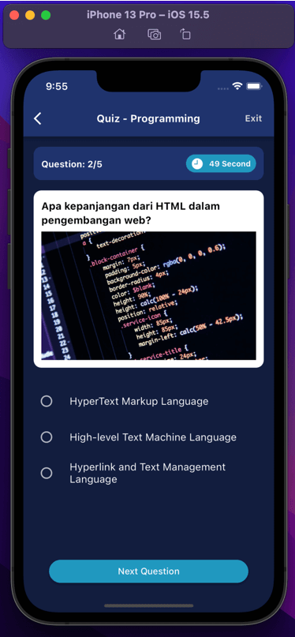
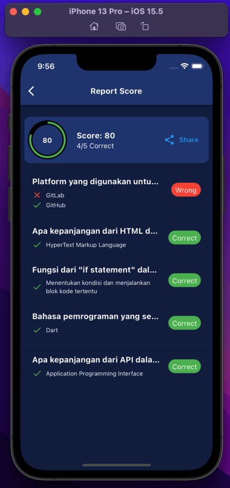

# adit_quiz
Just Assignment Test for member.id

### Video

### Content
| Page          | Screenshot | Spec |
|---------------|------------|------|
| Home          |  | 
1.) When open Quiz App will go to this homepage
 
2.) User can share this apps to social media or chat apps
 
3.) User can choose Quiz Topics (You can use firebase to store the Quiz Topics data)
 
4.) If User tap button Play, Quiz topics will be randomize for user to answer.
 |
| Topic         |  | 1.) This is the Topic Page, In this page you can see, scroll all list of the quiz topics |
| Topic Search  |  | 1.) User can also filter and search Quiz Topics |
| Quiz          |  | 
1.) After User tap Quiz Topics question will be appear and there’s a time limit foreach question (eg: 30 seconds)
 
2.) If User tap Exit, then will go to HomePage
 
3.) If User tap the Answer then system will detect whether the answer is wrong or correct, and then move to next question.
 
4.) If the time is already finish then will move to next question.
 |
| Score         |  | 
1.) After all of question is already finish then results page will appear
 
2.) User can share their scores.
 
3.) After finish then user can back to HomePage.
 |

### Test Run:
- iOS ✅
- Android ✅
- MacOs ✅
- Windows ？